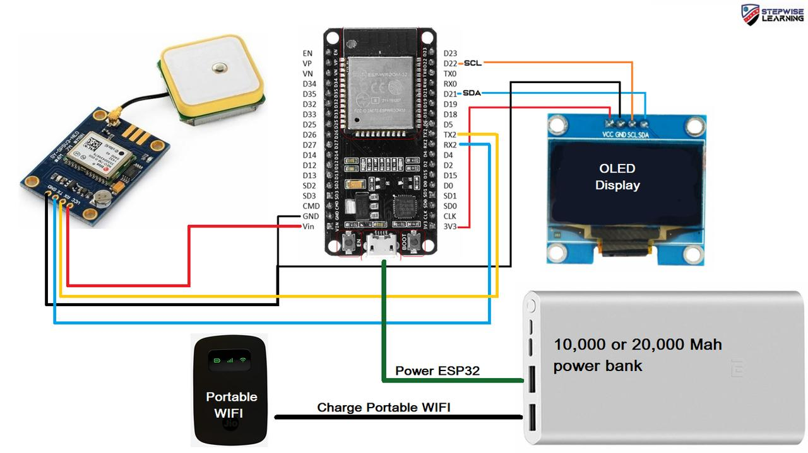

# 🚗 Real-Time Vehicle Tracking System using ESP32 and GPS

A compact Arduino-based system that tracks a vehicle's real-time GPS location using an ESP32 board and displays coordinates on an OLED screen. This project can be expanded to send data to the cloud for live tracking.

---

## 📦 Project Structure

```
real-time-vehicle-tracking/
│
├── oled_display_test/            # Code for testing OLED display
│   └── L11-SourceCodeTestingtheOLEDdisplay.ino
│
├── board_testing/                # Code to verify ESP32 board functionality
│   └── board_testing.ino
│
├── gps_tracking/                 # Main GPS tracking logic
│   └── gps_tracking_ESP32.ino
│
├── images/                       # hardware setup or output screenshots
├── README.md
├── LICENSE
└── .gitignore
```

---

## 🧰 Components Used

- ESP32 Dev Board  
- GPS Module (e.g., NEO-6M)  
- OLED Display (0.96" I2C, SSD1306)  
- Jumper Wires  
- Optional: USB cable for power and Serial Monitor

---

## 🔧 Required Arduino Libraries

Install these libraries from the **Arduino Library Manager**:

- [Adafruit GFX Library](https://github.com/adafruit/Adafruit-GFX-Library)  
- [Adafruit SSD1306](https://github.com/adafruit/Adafruit_SSD1306)  
- [TinyGPS++](https://github.com/mikalhart/TinyGPSPlus)

---

## 🛠️ Getting Started

### 🔹 Step 1: Clone the Repository

```bash
git clone https://github.com/MayuriMotwani/real-time-vehicle-tracking.git
cd real-time-vehicle-tracking
```

### 🔹 Step 2: Open `.ino` Files in Arduino IDE

- For OLED display test: `oled_display_test.ino`  
- For ESP32 board check: `board_testing.ino`  
- For full GPS tracking: `gps_tracking_ESP32.ino`

### 🔹 Step 3: Select Board & Port

- **Board**: `ESP32 Dev Module`  
- **Upload Speed**: `115200`  
- **Port**: Select the one assigned by your OS

### 🔹 Step 4: Upload & Monitor

- Upload the code to your ESP32  
- Open **Serial Monitor** at `115200` baud  
- Watch live GPS data stream in real time

---

## 📸 Images



---

## 🚀 Future Improvements

- Send GPS coordinates to a cloud server or Firebase  
- Add SMS alerts using GSM module  
- Show location on a mobile/web map using MQTT or HTTP  

---

## 👤 Author

**Mayuri Motwani**  
🔗 [GitHub Profile](https://github.com/MayuriMotwani)

---

## 📄 License

This project is licensed under the [MIT License](LICENSE).
```
